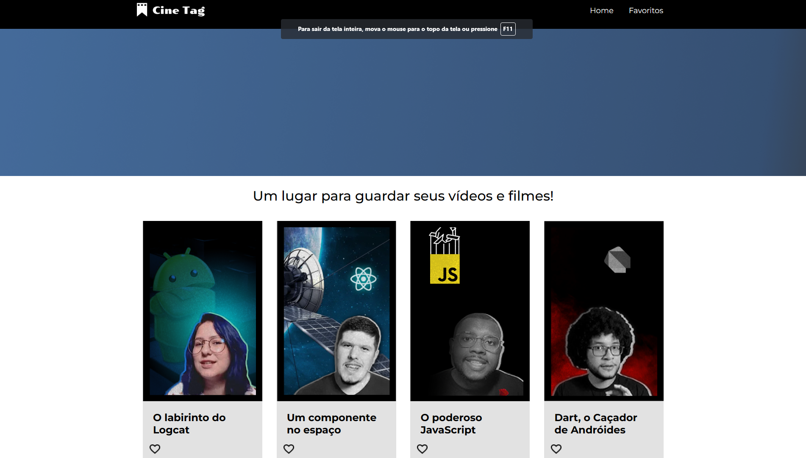

# Cine Tag
 
 

Cine Tag é um site de guardar filmes e vídeos feito em react e react-router-dom

## :hammer: Funcionalidades do projeto

Ver vídeos e filmes podendo passar de páginas e favoritos cada uma

## :wrench: Técnicas e tecnologias utilizadas

- ⚛️ `React`
- 📡 `React-router-dom`

## :file_folder: Acesso ao projeto 

Você pode acessa o projeto e baixar ele pelo <a href="https://github.com/EversonSoucek/Cinetag">Github</a>

## :computer: Rodar o projeto

Para abrir e rodar o projeto execute no terminal `npm i` para instalar as dependências e `npm start` para iniciar o projeto

Depois, acesse <a href="http://localhost:3000/">http://localhost:3000/</a> no seu navegador

## :pencil: Autores

 Everson Adolfo Soucek Junior(https://github.com/EversonSoucek)